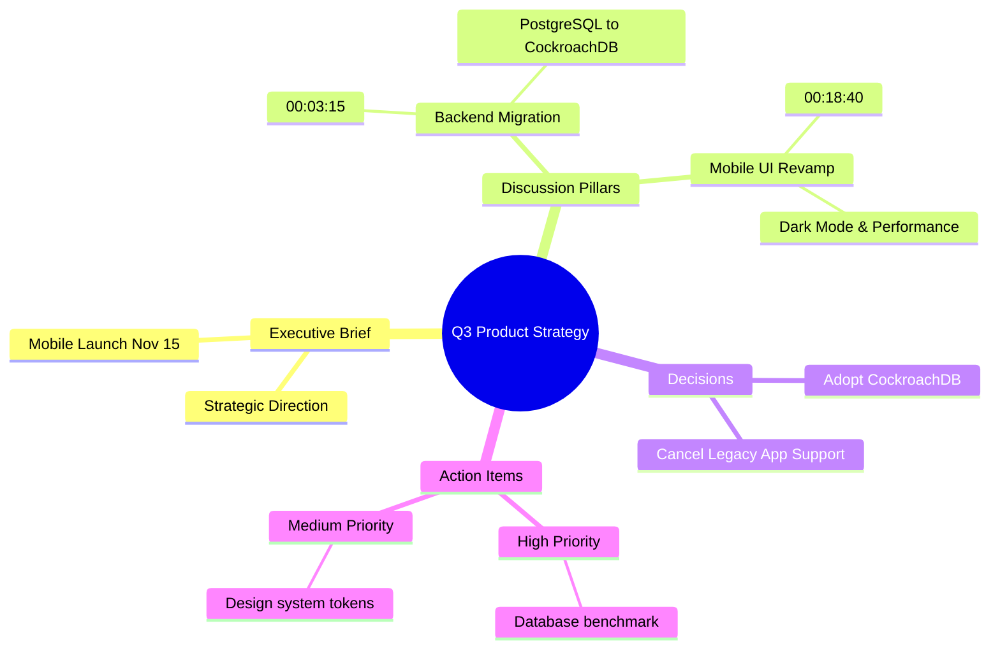

# 🎙️ Plaud AI Meeting Studio

A high-performance, CLI-based executive meeting intelligence and transcription studio powered by **Google Gemini 2.5 Flash** and the **Google GenAI SDK (`google-genai`)**.

Inspired by Plaud AI devices, this studio turns raw audio/video recordings into structured executive briefs, pillar breakdowns, speaker-diarized transcripts, action item matrices, decision logs, and visual **Mermaid mindmaps**.

---

## ✨ Features & Architecture

- **🚀 Gemini File API Pipeline:** High-speed streaming upload for large audio/video recordings (`.mp3`, `.wav`, `.m4a`, `.mp4`, `.aac`, `.flac`, `.mov`, `.mkv`, etc.) with asynchronous polling and auto-cleanup.
- **🎙️ In-Browser Live Audio Recording:** Capture live meetings and in-person discussions directly from your microphone with automatic saving and 1-click intelligence extraction.
- **🎨 Glassmorphism Web Studio & Theme Switcher:** Dual-mode design system with 🌙 Deep Dark Mode & ☀️ Crisp Light Mode, frosted glass cards, and sticky executive header.
- **📑 Plaud-Style Intelligence Reports:**
  - **Executive Brief:** 3-line high-impact summary (Strategic Purpose, Key Breakthrough, Immediate Next Step).
  - **Key Discussion Pillars:** Chronological deep-dive into themes with timestamps and speaker arguments.
  - **Speaker Diarization & Full Transcription:** Accurate dialogue attribution and time stamps.
  - **Action Items Matrix:** Rich Markdown table with Task, Assignee, Priority, and Due Date.
  - **Decisions & Reversals:** Approved decisions vs. rejected or overturned proposals.
  - **Mermaid Mindmap:** Interactive ````mermaid` mindmap code block ready for visualization.
  - **Structured JSON Export:** Machine-readable companion JSON containing parsed action items and metadata.
- **👀 Watchdog Live Directory Monitor:** Drops files into `inputs/` and automatically processes them in real-time.
- **🔒 Safe UTF-8 Handling:** Strict UTF-8 encoding across all file operations on Windows.

---

## 📁 Directory Structure

```text
D:\claude word\plaud AI\
├── .env                       # API key & model settings
├── .env.example               # Example configuration template
├── .venv\                     # Python virtual environment
├── inputs\                    # Directory for raw audio/video files
├── outputs\                   # Generated Markdown & JSON reports
├── core\
│   ├── __init__.py
│   ├── config.py              # Path resolutions & environment loader
│   ├── analyzer.py            # Gemini File API & prompt generation
│   ├── parser.py              # Markdown & JSON export parser
│   ├── watcher.py             # Watchdog folder monitor
│   └── ui.py                  # Rich console rendering & tables
├── meeting_cli.py             # Main CLI entry point
├── run_cli.bat                # 1-Click Windows launcher & interactive menu
├── requirements.txt           # Python dependencies
└── README.md                  # Studio documentation
```

---

## ⚡ Quick Start

### 1. Configure your Gemini API Key
Open `.env` (or copy `.env.example` to `.env`) and add your Gemini API Key from [Google AI Studio](https://aistudio.google.com/app/apikey):

```env
GEMINI_API_KEY=AIzaSy...your_actual_key_here
GEMINI_MODEL=gemini-2.5-flash
```

### 3. Launch the Streamlit Web Studio UI
```bash
# Launch via batch script:
run_ui.bat

# Or run directly via streamlit:
streamlit run app.py
```
Access the Dark Studio Web UI in your browser at: **http://localhost:8501**

---

## 🖥️ CLI Commands

### 1. Process a Single Recording
```bash
# Process a file inside the inputs/ folder:
python meeting_cli.py process "inputs/board_meeting.mp3"

# Or just specify the filename if it is located in inputs/:
python meeting_cli.py process "board_meeting.mp3"

# Specify a custom model:
python meeting_cli.py process "board_meeting.mp4" --model gemini-2.5-flash
```

### 2. Watch Directory (Automatic Background Processing)
Monitors the `inputs/` directory. Whenever a new `.mp3`, `.wav`, `.m4a`, or `.mp4` file is saved or dropped in, it is automatically processed.
```bash
python meeting_cli.py watch
```

### 3. List Past Meeting Reports
Displays an archive table of all generated meeting reports and their file sizes.
```bash
python meeting_cli.py list
```

### 4. View a Report in Terminal
Renders the Markdown report cleanly inside your console window.
```bash
python meeting_cli.py view "board_meeting"
```

### 5. Interactive Menu Mode
Simply run without arguments to open the interactive menu:
```bash
python meeting_cli.py
```
Or double-click `run_cli.bat`.

---

## 📊 Sample Output Structure

Each processed meeting generates two files in `outputs/`:
- `outputs/<meeting_name>_report.md` (Plaud-style Markdown report)
- `outputs/<meeting_name>_report.json` (Structured JSON representation)

### Visual Architecture Mindmap Example

