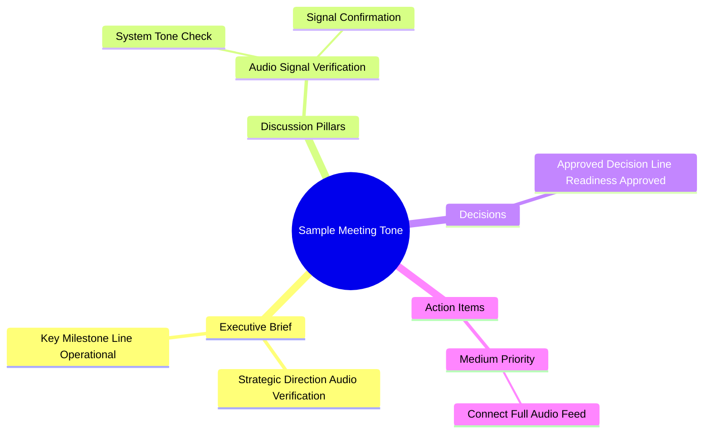

# 🎙️ Meeting Intelligence Report: Sample Meeting Tone

**Generated:** 2026-08-23 20:50  
**Duration:** 00:00:03  
**Identified Participants:** System Signal / Audio Test Tone (No vocal participants)

---

## ⚡ Executive Brief
> • **Strategic Purpose:** Perform a baseline audio signal and system readiness check.  
> • **Key Breakthrough & Consensus:** Confirmed successful audio signal transmission and system audio feed connectivity.  
> • **Immediate Next Step:** Initiate the main communication session once participants connect.

---

## 🏛️ Key Discussion Pillars

### 1. [00:00:00] Audio Signal & Tone Verification
- **Context & Objective:** Initial technical check to verify signal clarity and playback capabilities.
- **Key Arguments & Perspectives:**
  - **System Tone:** Emitted standard dual audio frequency beeps/tones.
- **Consensus & Outcome:** Audio feed is clear and functional.

---

## 📋 Action Items Matrix

| # | Task Description | Assignee | Priority | Due Date | Notes / Dependencies |
|---|------------------|----------|----------|----------|----------------------|
| 1 | Connect audio feed for full meeting session | Technical Host | MED | Immediate | Awaiting participant line connection |

---

## ⚖️ Decisions & Reversals

### ✅ Final Decisions Approved
1. **[00:00:00] Line Readiness Approved:** Confirmed system audio output is ready for recording.

### 🔄 Rejected & Overturned Ideas (Reversals)
*No rejected or overturned proposals were recorded during this brief signal test.*

---

## 🗺️ Visual Architecture (Mermaid Mindmap)

---

## 🗣️ Speaker Diarization & Complete Transcript

**[00:00:00] System Signal:** [Dual tone audio beeps / test signal]